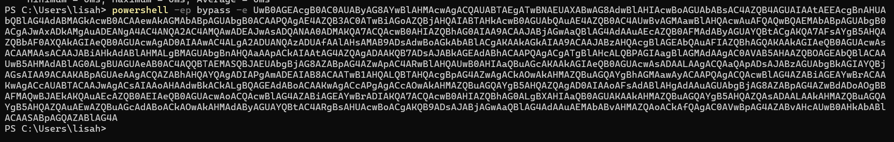
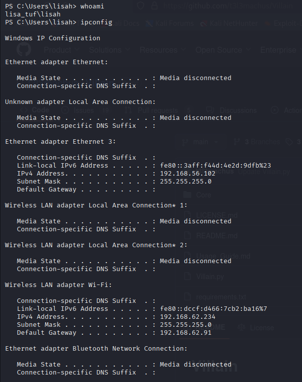
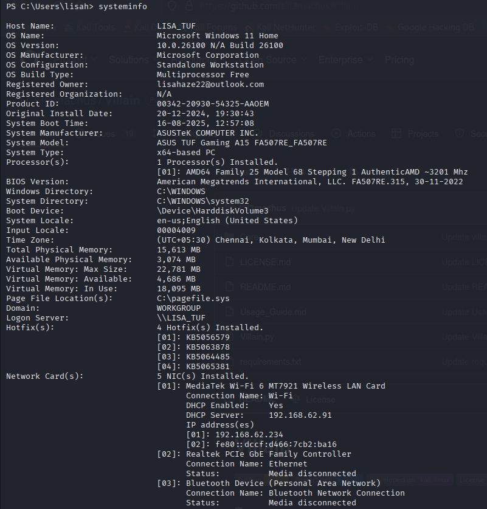

# Villain Framework Reverse Shell Report

## ⚙️ Setup Info
- Payload: `windows/reverse_tcp/powershell`
- LHOST: 192.168.56.101
- LPORT: 443

## 🔁 Payload Delivery Method
- I began by generating a Windows reverse TCP payload in Villain, specifying powershell as the execution method, with my Kali machine’s eth1 IP set as the LHOST. This created a payload that, when run, would initiate a reverse connection back to my attack machine. I then transferred and executed this payload on the target Windows VM. Upon execution, the payload established a reverse TCP session from the Windows machine back to Kali, which was immediately detected in Villain as a new active shell session. From there, I was able to interact with the session, confirming that the payload was successfully delivered and that I had command-line access to the target system.

## 🖥️ Captured Info
- Hostname: lisa_tuf\lisah
- IP Address: 192.168.56.102
- User: LISA_TUF

## 🔎 Enumeration Performed
  
  
  

