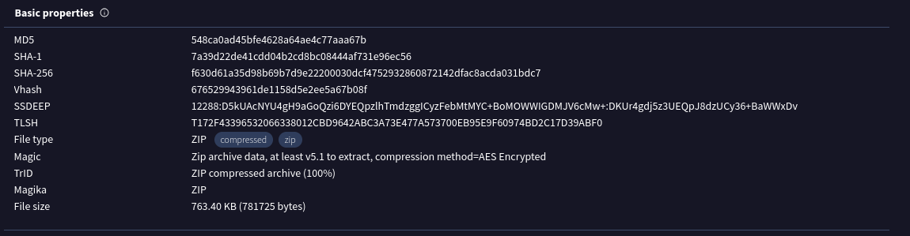
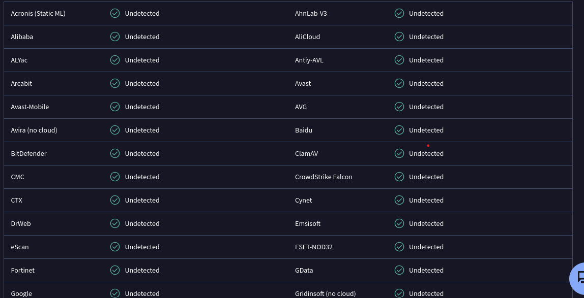
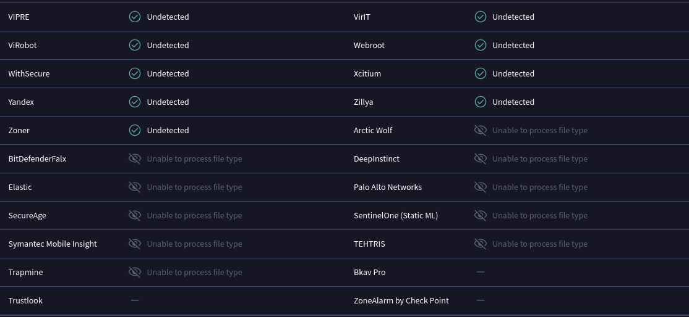
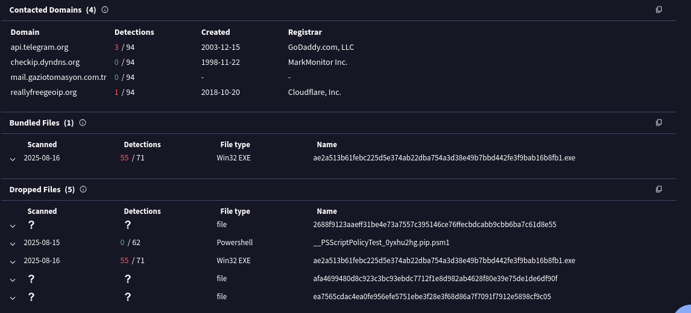
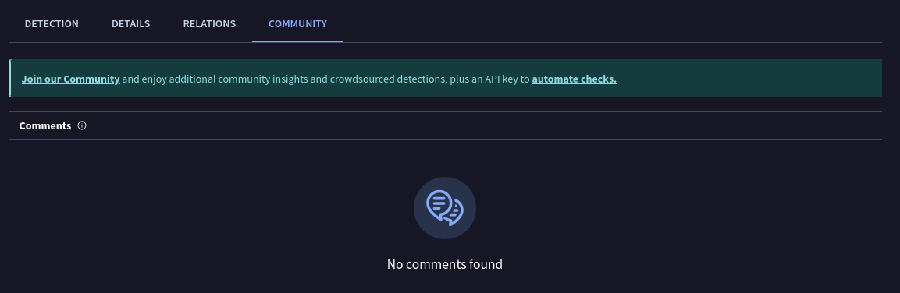

# VirusTotal Analysis Report

## 📁 File Info
- Filename: malware_sample.zip
- File inside: malware_sample.docx
- Hashes:
  - MD5: 548ca0ad45bfe4628a64ae4c77aaa67b
  - SHA1: 7a39d22de41cdd04b2cd8bc08444af731e96ec56
  - SHA256: f630d61a35d98b69b7d9e22200030dcf4752932860872142dfac8acda031bdc7

## 🧪 Detection
| Engine                | Detection   | Engine               | Detection   |
|------------------------|-------------|----------------------|-------------|
| Acronis (Static ML)    | Undetected  | AhnLab-V3            | Undetected  |
| Alibaba                | Undetected  | AliCloud             | Undetected  |
| ALYac                  | Undetected  | Antiy-AVL            | Undetected  |
| Arcabit                | Undetected  | Avast                | Undetected  |
| Avast-Mobile           | Undetected  | AVG                  | Undetected  |
| Avira (no cloud)       | Undetected  | Baidu                | Undetected  |
| BitDefender            | Undetected  | ClamAV               | Undetected  |
| CMC                    | Undetected  | CrowdStrike Falcon   | Undetected  |
| CTX                    | Undetected  | Cynet                | Undetected  |
| DrWeb                  | Undetected  | Emsisoft             | Undetected  |
| eScan                  | Undetected  | ESET-NOD32           | Undetected  |
| Fortinet               | Undetected  | GData                | Undetected  |
| Google                 | Undetected  | Gridinsoft (no cloud)| Undetected  |

## 📡 Network Indicators
**Contacted Domains:**
| Domain                   | Detections | Created     | Registrar       |
|---------------------------|------------|-------------|-----------------|
| api.telegram.org          | 3 / 94     | 2003-12-15  | GoDaddy.com LLC |
| checkip.dyndns.org        | 0 / 94     | 1998-11-22  | MarkMonitor Inc.|
| mail.gaziotomasyon.com.tr | 0 / 94     | -           | -               |
| reallyfreegeoip.org       | 1 / 94     | 2018-10-20  | Cloudflare, Inc.|

## 📊 Behavioral Summary
**Bundled Files:**
- `ae2a513b61febc225d5e374ab22dba754a3d38e49b7bbd442fe3f9bbab16b8fb1.exe`  
  - Type: Win32 EXE  
  - Detections: **55 / 71**

**Dropped Files:**
- `2688f9123aaef31be4e7a7557c395146ce76ffecbdcab9cb6b6a7c61d8e55`  
  - Type: file  
  - Detections: ?  
- `__PSScriptPolicyTest_0yxhu2hg.pip.psm1`  
  - Type: Powershell  
  - Detections: **0 / 62**  
- `ae2a513b61febc225d5e374ab22dba754a3d38e49b7bbd442fe3f9bbab16b8fb1.exe`  
  - Type: Win32 EXE  
  - Detections: **55 / 71**  
- `afa699480d8c923c3bc93ebdc7712f1e8d982ab4628f80e39e75de1de6df90f`  
  - Type: file  
  - Detections: ?  
- `ea7565cdac4ea0fe956efe5751ebe3f28e3f68d86a7ff091f7912e589cf9c05`  
  - Type: file  
  - Detections: ?  

## 🗣️ Community Insight
- No votes or user comments are shown for the infected zip.

## 🔐 Public Link
- https://www.virustotal.com/gui/file/f630d61a35d98b69b7d9e22200030dcf4752932860872142dfac8acda031bdc7/detection

## 🖼️ Screenshots
 
 
 
 
 